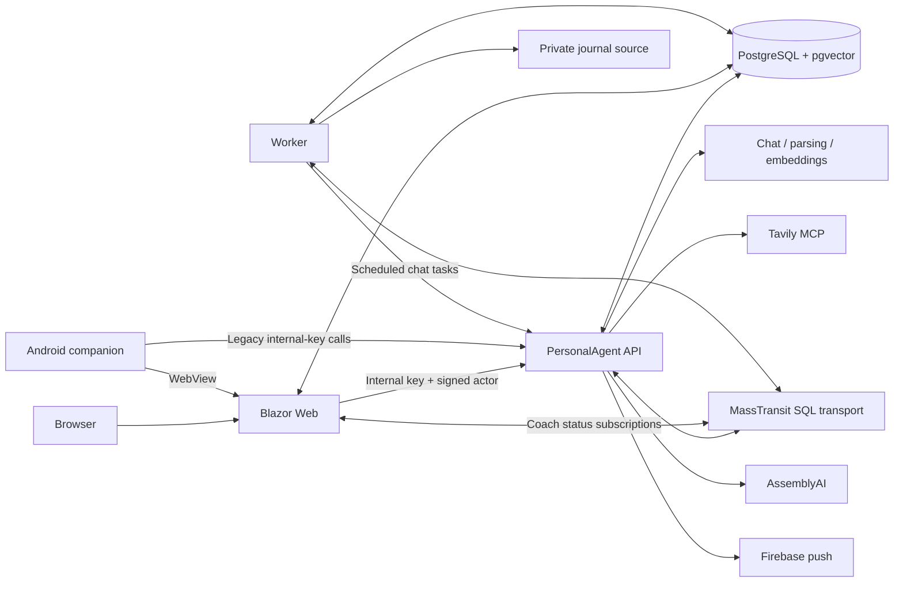

# Architecture

Reviewed 2026-09-13 against `b7157f7`, including the September 10–13 deliveries. This page describes current behavior; the decision register distinguishes future changes. Validation and remaining acceptance criteria live in the [roadmap](plans/roadmap.md).

## Boundaries worth keeping

Web is the trusted authentication boundary for browser users. The API resolves actor/subject access and owns agent execution, persistence services, retrieval, model providers, and tool authorization. Worker owns background job delivery and domain processing. Contracts provide typed cross-service messages. PostgreSQL is both storage and messaging infrastructure, avoiding another broker for this deployment size.

The intended AI gateway boundary is stronger than today's implementation: all AI vendor adapters, provider-specific configuration, SDKs, model selection policy, and error translation belong to the API project. Domain behavior should depend on capability interfaces and neutral DTOs. API hosts AssemblyAI and persists provider jobs behind a neutral upload-reference bus contract. Scheduled tasks now request the API default model; Web loads the current API catalog at chat initialization. The catalog refreshes provider availability on demand through an API-local adapter, with reviewed eligibility policy and outage fallback; saved sessions retain their model ID. See [0004](decisions/0004-agent-service-boundary.md).

`AgentPlayground.Integrations` is host infrastructure shared by API/Web/Worker for encrypted runtime integration configuration, metadata-only Sentry error reporting, OpenTelemetry instrumentation and OpenInference AI spans. Web provides the settings form; API authorizes administrators and owns revision edits/promotions; each host independently reconciles active Sentry and telemetry revisions. Export is disabled until configured. See [0010](decisions/0010-runtime-integration-settings.md), [0019](decisions/0019-observability.md) and [0020](decisions/0020-live-database-telemetry-settings.md).

## Current persistence and operations

- `PostgresConfigurationSource` loads encrypted configuration at startup; bootstrap credentials remain external.
- Sentry and OpenTelemetry use separate encrypted revision/pointer settings with versioned migration and per-instance acknowledgements. Existing database rows are editable in Settings. OpenAI/AssemblyAI API credentials reload for new requests; chat model policy is read from active database settings on each catalog request. Other consumers retain explicit restart requirements. See [integration operations](runbooks/integration-settings.md) and [provider credential limits](decisions/0012-live-provider-credentials.md).
- `PostgresAgentSessionStore` persists sessions/messages. Chat recreates the framework session per request and replays user/assistant history; it does not persist full framework tool/workflow state.
- `AgentMemorySchemaInitializer` creates and alters tables at startup. Worker also creates journal tables. There is no explicit versioned migration history in these paths.
- Journal vectors currently use a hard-coded `vector(1536)` in `SyncWorkJournalConsumer`; embedding compatibility must be addressed in the gateway design.
- Audio is stored as database bytes and retained after successful processing. API owns persisted transcription-provider jobs; Worker receives neutral segments, persists utterances, and waits for speaker attribution when required. Domain writes and outgoing messages commit through the coaching outbox. Owners can attach/replace audio on completed calls or delete terminal-call audio; transcripts remain readable. Backup deletion reconciliation and recording-inclusive recovery remain open. See [transcription operations](runbooks/transcription-gateway.md).
- Web subscribes to transactional coaching status events with per-instance SQL topic fan-out and periodic reconciliation, refreshing open recording pages without losing speaker-review drafts. This is a live view of persisted progress, not a general workflow engine.
- Scheduled agent tasks and notifications have durable job IDs, trusted actor/subject attribution, attempts, current authorization checks and guarded pending cancellation. API owns execution; Worker delivers job IDs. Interrupted agent runs recover a saved response or enter NeedsReview instead of blindly replaying effects. Completion intent uses the domain outbox. A restored database can contain pending real actions. See [scheduled jobs](runbooks/scheduled-jobs.md).
- Web persists Data Protection keys in PostgreSQL. Treat those rows as security-sensitive during development imports.

## Current user experience

The shared recording view and evidence drawer provide timestamp seeking and optional playback following. Chat drafts create a saved session on first send; explicit model changes persist server-side, and new drafts prefer the last available browser choice. Jobs, chats, recordings and Settings retain selection in query parameters. Scheduled result conversations stay read-only. See [navigation and playback](runbooks/navigation.md).

Coaching retrieval uses filename-derived recording dates, latest-call scope, recency preference and utterance evidence, with lexical recovery for missing exercise tags. Synthetic regressions and an opt-in live-model comparison runner exist; held-out quality evaluation and the Learning Lab proposal/promotion UI remain future work. See [evaluation evidence](runbooks/coach-retrieval-evaluation.md).

Do not rename every project or move all infrastructure in one pass. Root Dockerfiles are actively used by Compose/Railway scripts. Keep the small shared PostgreSQL deployment until operational evidence calls for more infrastructure.

## Areas to improve deliberately

`AgentToolRegistry` now declares tool metadata and factories once; the permission catalog and context-bound agent functions share those definitions. Follow the [tool registration guide](runbooks/adding-agent-tools.md) when adding capabilities. The transcription provider has moved to API; Worker still combines polling/orchestration and SQL domain transitions. Extract focused handlers as those capabilities change, preserving the outbox and provider-job safeguards. Split remaining large endpoint groups by capability while preserving security filters and route tests.
