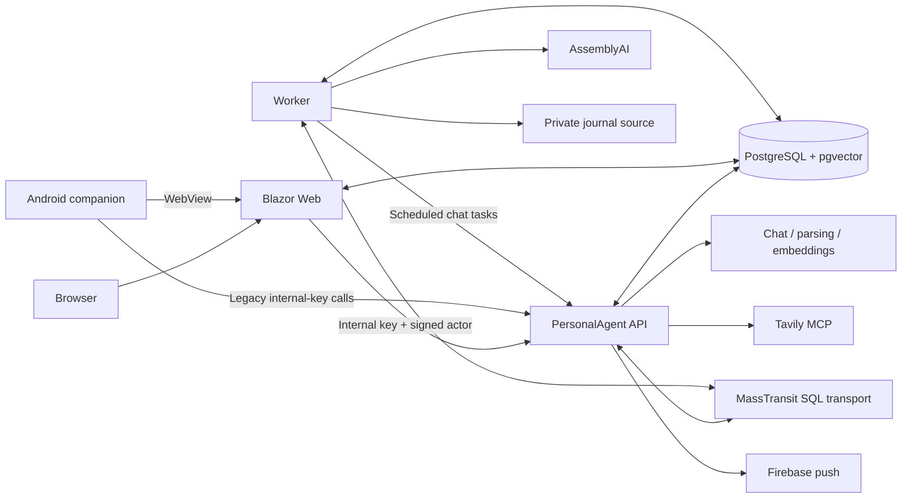

# Architecture

Reviewed 2026-09-07 against `34d65e2` and the accompanying cleanup. This page describes current behavior; the decision register distinguishes future changes.

## Boundaries worth keeping

Web is the trusted authentication boundary for browser users. The API resolves actor/subject access and owns agent execution, persistence services, retrieval, model providers, and tool authorization. Worker owns background job delivery and domain processing. Contracts provide typed cross-service messages. PostgreSQL is both storage and messaging infrastructure, avoiding another broker for this deployment size.

The intended AI gateway boundary is stronger than today's implementation: all AI vendor adapters, provider-specific configuration, SDKs, model selection policy, and error translation belong to the API project. Domain behavior should depend on capability interfaces and neutral DTOs. Worker still hosts AssemblyAI. Scheduled tasks now request the API default model; Web loads the current API catalog at chat initialization. See [0004](decisions/0004-agent-service-boundary.md).

## Current persistence and operations

- `PostgresConfigurationSource` loads encrypted configuration at startup; bootstrap credentials remain external.
- `PostgresAgentSessionStore` persists sessions/messages. Chat recreates the framework session per request and replays user/assistant history; it does not persist full framework tool/workflow state.
- `AgentMemorySchemaInitializer` creates and alters tables at startup. Worker also creates journal tables. There is no explicit versioned migration history in these paths.
- Journal vectors currently use a hard-coded `vector(1536)` in `SyncWorkJournalConsumer`; embedding compatibility must be addressed in the gateway design.
- Audio is staged as database bytes; `TranscribeCoachCallConsumer` reads it, calls AssemblyAI, persists utterances, and waits for speaker attribution when required.
- MassTransit handles scheduled commands and background delivery. A restored transport database can contain pending real actions.
- Web persists Data Protection keys in PostgreSQL. Treat those rows as security-sensitive during development imports.

## Areas to improve deliberately

`AgentChatService` constructs functions while `ToolAccessService` separately declares the catalog. Consolidate those definitions before adding more tools. The transcription consumer mixes orchestration, provider calls, and SQL state changes; split through domain-facing interfaces as the provider moves. Split the large endpoint map by capability when changing those endpoints, preserving the security filters and route tests.

Do not rename every project or move all infrastructure in one pass. Root Dockerfiles are actively used by Compose/Railway scripts. Keep the small shared PostgreSQL deployment until operational evidence calls for more infrastructure.
