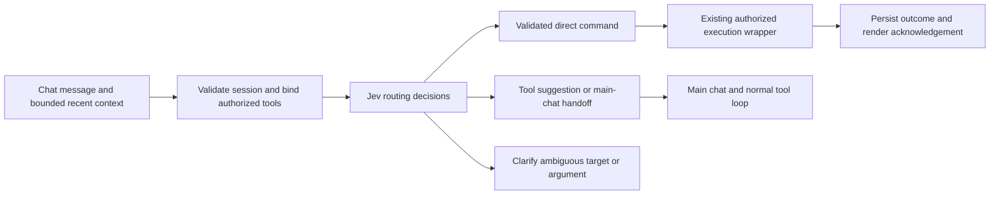
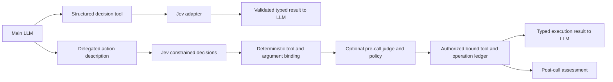
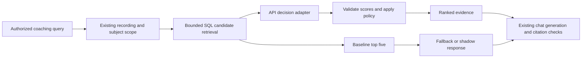

# Jev implementation plan

Status: **First pre-chat routing slice implemented 2026-09-19; broader experiments remain proposed.** Research was completed 2026-09-18 against `b14490e`. The API Choice adapter, database settings, shadow/suggestion modes, narrow clock fast path and synthetic fixtures now exist. Subsequent maintainer-driven deployment tests confirmed live provider calls and direct clock routing. The expanded catalog now includes all 12 current local/Tavily tools when authorized; chat continues to bind arguments and execute non-clock tools. See [decision 0027](../decisions/0027-full-tool-routing.md). See [implemented scope and verification](../runbooks/jev-routing.md), [decision 0026](../decisions/0026-structured-decision-provider.md) and [roadmap](roadmap.md#jev-structured-decisions--first-routing-slice-implemented-2026-09-19). Provider access and the clock path are verified; slices 1/A1 remain partial and broader quality evaluation is outstanding. The maintainer prioritized pre-chat routing and deferred recovery rehearsals on 2026-09-19.

## Recommendation

Evaluate **pre-chat routing**, **LLM-delegated structured decisions and tool dispatch**, **tool-call judging**, and **coaching-evidence reranking** as independently switchable experiments. Automation includes simulated home devices. Prioritize the shared provider/binding foundation and automation experiments; retrieval and transcript tagging do not block them. Keep text generation, embeddings, transcription and authorization in their existing paths. Start with synthetic comparisons, then shadow evaluation, then explicitly promoted opt-in modes.

The experiments have different economics. Direct automation may avoid a full chat-model round trip; tool-selection assistance may improve calls while still using the chat model. Today's retrieval and tagging use SQL and string matching, so Jev adds cost and latency there. Measure complete-turn correctness, cost and latency separately for each path, including fallbacks.

## What Jev provides, and what the evidence establishes

TypeSafe's September 15 [announcement](https://typesafe.ai/blog/introducing-system-one-models-and-jev) describes System One models as structured decision models trained with Reinforcement Learning for Calibrated Decisions, using parallel outputs instead of generated prose. It advertises 70–500 ms requests and large relative speed/cost improvements. These are vendor results, not measurements in our deployment. Its “can't hallucinate” claim concerns constrained output types; a valid category can still be factually wrong.

The [workflow evaluation](https://evals.typesafe.ai/) compares four vendor-built workflows against reference probabilities from large-model consensus. This demonstrates agreement with that reference under those harnesses, not independently labeled correctness on coaching retrieval. Our human-reviewed evidence labels and end-to-end tests must decide adoption.

The [primitive overview](https://docs.typesafe.ai/introduction) describes independent questions against shared state. Questions in one request cannot consume one another's answers; dependent steps require another request or application logic.

| Primitive | Documented output | Proposed use |
| --- | --- | --- |
| [Choice](https://docs.typesafe.ai/primitives/choice) | A supplied option, its distribution, and confidence; up to 255 options | Select among known utterance handles plus an explicit `none` option |
| [Score](https://docs.typesafe.ai/primitives/score) | Expected position on an ordered rubric, distribution, and confidence; 2–10 levels | Rank evidence as unrelated, contextual, or directly supporting |
| [Noul](https://docs.typesafe.ai/primitives/noul) | Probability of yes, between 0 and 1; no separate confidence | Independent exercise/intent labels or an explicit support judgment |

[Confidence](https://docs.typesafe.ai/confidence) summarizes the shape of a distribution; it is not interchangeable with the selected option's probability or a measured accuracy percentage. For example, a Noul of 0.5 means uncertainty about a proposition, not medium relevance. Thresholds need task-specific calibration and a fallback path.

As of the research date, the [models reference](https://docs.typesafe.ai/models) lists `jev-1.13.0`, with `jev-latest` pointing to it. Inputs are text, including structured text objects; audio and images need prior conversion. Limits are 64k tokens per request and 32k for state plus the longest question. Published capacity is 1,200 requests/minute and 250,000 tokens/second, explicitly subject to change. Input pricing is $0.042/million tokens, with free output tokens. Pin a version for evaluation and promotion; record the returned model ID. Recheck account-specific access and limits before implementation.

The [quick start](https://docs.typesafe.ai/introduction/quickstart) uses bearer-authenticated `POST https://api.typesafe.ai/v1/systemone` with `state`, `model`, and `questions`. The [SDK index](https://docs.typesafe.ai/sdk) lists Python and JavaScript/TypeScript; it does not document a .NET SDK. A small typed `HttpClient` adapter fits this repository better than adding another runtime. The [API reference](https://docs.typesafe.ai/api) specifies answer maps and token usage, with 401/422 for authentication/validation and 429/529 for rate limiting/overload. Validate the actual wire contract with a synthetic request before coding against examples.

## Best uses in the current system

The priorities below are repository-specific engineering judgments, not vendor performance claims.

| Priority | Current evidence | Proposed change and value | Scope and limitation |
| --- | --- | --- | --- |
| First-class: automation/tool routing | `AgentToolRegistry` and `AgentToolBinder` expose authorized functions; main chat currently selects tools. | Directly dispatch clear commands or suggest tools before the main model. | Simulated home devices first; real platform integration and durable direct-action records are new work. |
| First-class: LLM delegation and tool-call judging | Main chat already invokes bound functions; `LoggingAIFunction` checks access before invocation. | Expose structured decision and delegated-action tools, sharing a deterministic argument-binding layer; judge proposed calls and recorded outcomes. | Model chooses from supported values; code validates and dispatches. Judging is advisory initially and cannot replace permission checks. |
| 1: evidence reranking | [`CoachCheckinService.SearchCoachCheckinsCoreAsync`](../../PersonalAgent/Services/CoachCheckinService.cs) ranks by exercise hints, vector distance and recency, returns five chunks, and attaches preceding utterances. [Current evaluation](../runbooks/coach-retrieval-evaluation.md) records remaining exercise-transition and exact-citation errors. | Score whether each candidate actually supports the question; distinguish an actionable coach cue from an acknowledgement or adjacent topic. | API-only initial capability. Jev cannot retrieve evidence absent from the candidate pool or guarantee the final chat answer. |
| 2: semantic transcript tags | [`CoachTranscriptProcessingService`](../../PersonalAgent.Worker/Services/CoachTranscriptProcessingService.cs) groups four utterances and derives exercise/intent/priority tags with substring matching. | Independent Noul judgments over the existing vocabulary could recover paraphrases and reduce accidental matches. | Additional API capability and neutral Worker request/result contract. Preserve lexical recovery; tags remain relevance hints. Measure against today's effectively free classifier. |
| 3: offline answer review | [`CoachRetrievalEvaluation`](../../scripts/CoachRetrievalEvaluation/README.md) has repeatable trials, saved outputs, citation checks and versioned scoring. | Use Jev to flag possible unsupported claims or wrong exercise attribution for human inspection. | Supplement exact citation checks and independent labels. Do not use Jev as both sole judge and candidate, or let it promote itself. |
| Later: retrieval hints | [`AgentChatService`](../../PersonalAgent/Services/AgentChatService.cs) and its registered tools already orchestrate retrieval. | Classify a request as latest, historical, or ambiguous, or suggest a known exercise hint. | Only after reranking proves value. Extra routing risks contradicting filename corrections and conversational context; retain explicit user scope and existing tools. |

Poor initial uses:

- **Speaker identity:** [decision 0025](../decisions/0025-stereo-coach-attribution.md) deliberately uses fixed stereo channels and manual review for unknowns. Do not replace that evidence with a probabilistic guess.
- **Journal parsing replacement:** [`WorkJournalParsingService`](../../PersonalAgent/Services/WorkJournalParsingService.cs) emits dates and full original Markdown for a variable number of entries. Jev cannot directly generate those strings. A future deterministic heading parser could copy source spans and reserve classification for ambiguous cases; it should be evaluated separately.
- **Chat, summaries, embeddings, or speech recognition:** their required outputs differ from Jev's decision primitives. Existing coach summaries are templated, so there is no summary-model bill to eliminate today.
- **Authorization, scheduler execution, or safety authority:** retain server-bound actor/subject checks, tool permission checks, idempotency, and human review. Model probabilities never grant access, send notifications, or diagnose injuries.

## Automation track: tool routing before the main chat

The maintainer requested general automation testing, home-control chat, and better tool calling before the main chat on 2026-09-18. This is part of the initial experiment, not dependent on retrieval succeeding. TypeSafe's [smart-home demo](https://docs.typesafe.ai/demos/smart-home) batches questions about request category, scope and action, with code ignoring irrelevant answers. It uses an LLM for conversation and decomposing compound requests. This supports the architecture, but establishes neither our accuracy nor real-device reliability.

### Three paths to compare

- **Direct:** a single supported operation with complete, validated arguments invokes a bound function once; code formats a factual acknowledgement from its result. This can avoid the main chat model.
- **Suggest:** Jev supplies a tool and validated candidate arguments; the main model handles remaining interpretation and execution. No tool has already run. Initially retain the full authorized tool set; evaluate shortlisting separately so a mistaken router cannot hide a needed capability.
- **Clarify or hand off:** conversation, ambiguous targets, missing arguments, compound operations and unsupported input go to a targeted question or normal chat without speculative effects. Provider failure before execution also follows normal chat. Include Conversation, NeedsClarification and Unsupported outcomes rather than forcing a tool choice.

### Selection and arguments

[`AgentToolRegistry`](../../PersonalAgent/Services/AgentToolRegistry.cs) defines local and MCP registrations, and [`AgentToolBinder`](../../PersonalAgent/Services/AgentToolBinder.cs) binds functions to server-resolved access and wraps them with execution-time permission checks. Derive router candidates from that bound set. Add explicit per-tool fast-path adapters for supported arguments, parsing, execution policy and result formatting alongside the registrations; do not duplicate the catalog. Unreviewed MCP tools remain main-chat-only. Current `HasSideEffects` metadata is descriptive, not an approval or retry mechanism.

For home control, provide authorized devices/groups, aliases, supported operations and fresh state. Choice selects known device/action options; Noul can detect compound intent. Batch independent questions, then discard irrelevant outputs and validate device/action combinations in code. Independently confident answers can form an invalid combination. Include unknown/none options; above 255 choices, scope or stage lookup rather than silently truncating targets.

Jev cannot generate arbitrary string arguments. Parse explicit numbers, units, dates or exact source spans deterministically and validate against both schema and domain limits. Do not use a relevance Score to extract a thermostat temperature or silently map an exact request to a nearby preset. Free-text notifications, journal searches and complex scheduling can use main-chat argument generation. Preserve the existing current-time prerequisite and timezone rules for scheduling. Every generated argument still passes validation.

Use bounded recent user turns and trusted previous action results for “turn it off.” Resolve only a unique, currently authorized referent; otherwise clarify. Quoted commands, device names and retrieved text are data, not new requests. No model-selected actor, profile or role is authoritative.

| Test request | Expected behavior |
| --- | --- |
| “What time is it?” | Direct existing time tool and deterministic result formatting |
| “Turn on the living-room lamp” | Select the known simulated lamp, set `on`, invoke once and acknowledge its result |
| “Set the desk lamp to 35%” | Parse 35%, validate capability/range, then set the value |
| “Turn off all downstairs lights” | Resolve an explicit group; bounded execution with per-device outcomes |
| “Turn it off” after one device / after two different devices | Resolve the unique referent / clarify without acting |
| “Don't turn off the light” or “Explain how to turn off a light” | No device mutation |
| “Set the mood for dinner” | Use an unambiguous configured scene alias, or clarify/use main chat |
| “Turn the lamp on, then remind me in ten minutes” | Main-chat orchestration initially; do not execute a prefix before handing off the whole request |
| “Notify my phone that dinner is ready” | Tool-assisted chat for string arguments, or an exact-source-copy adapter if separately implemented |
| “Why did my coach change my squat cue?” | Normal chat/retrieval; existing behavior must remain usable |
| Unauthorized device, stale inventory, revoked permission | No unauthorized invocation or substitution of another target |

### Integration and execution lifecycle

Introduce API-local `IAgentRequestRouter` and `ToolRouteDecision` (Direct, Suggest, Clarify, MainChat), plus `IHomeAutomationGateway` with a stateful fake. There is no home-control adapter in the inspected registry. The actual platform is unspecified: Home Assistant or another provider is a later adapter choice. Keep its endpoint and credentials database-first. Register narrow capabilities such as read state, set light state and activate an allowlisted scene, rather than arbitrary service calls.

Place routing in [`AgentChatService.SendMessageCoreAsync`](../../PersonalAgent/Services/AgentChatService.cs) after session ownership and scheduled-conversation checks and tool binding, before semantic recall and main-model execution when the direct path needs neither. Refactor agent construction so router and chat share bound functions. Execute through `BoundAgentTool.Function`, preserving execution-time authorization. Persist direct user/assistant turns and outcomes so later conversation retains context. Home commands should not require semantic-memory recall or storage to complete.

The current chat persistence saves user/assistant interactions, not a complete execution ledger. Before enabling direct writes, add a durable operation record keyed by actor, session and client turn/request ID, with argument digest, status and result. Propagate the turn ID across retries; message text is not an idempotency key because repeating a command can be intentional. Atomically claim execution across API instances. Save action outcomes separately from response generation so a failed chat save cannot repeat an action.

Use absolute setters (`on`, `off`, explicit brightness), not toggles, for initial writes; pass provider idempotency keys where supported. After a submission timeout or crash between an external action and result persistence, mark the outcome Unknown and reconcile or request review. Do not blindly retry or hand the original instruction to another executor. An LLM may explain a saved result but must not redispatch it. Group actions retain per-target outcomes. Distinguish submitted, confirmed, failed and unknown; transport acceptance alone does not prove physical completion.

Start with simulated reads and light setters. Real locks, alarms and other consequential operations require explicit per-tool policies before enrollment. Routine authorized light commands need no blanket confirmation. Clarification or policy-required confirmation must bind to the exact operation and arguments. Autonomous monitoring and persistent home rules are separate trigger/scheduling/recovery work, outside this chat-command experiment.

### Automation evaluation gates

Add an opt-in automation harness alongside the coaching runner. Compare unchanged main-chat tool calling, Jev suggestions plus chat, and direct dispatch with fallback on identical inventories, messages and stateful fakes. Judge complete arguments, action count, resulting state and truthful acknowledgement, not just the tool name. CI uses deterministic providers; paid model evaluations remain explicit local runs.

Freeze a development split and at least 100 independently labeled held-out scenarios spanning direct, ambiguous, conversational, adversarial and multi-turn requests. Proposed gates: at least 95% exact tool-and-argument success on eligible simple commands, at least 50% direct coverage of that eligible set, zero mutations on no-action/ambiguous/unauthorized cases, and no existing chat/retrieval regression. Require at least 30% lower p95 latency or total model cost than the paired main-chat baseline on eligible commands, without lower correctness. Report uncertainty intervals and fallback-inclusive totals; abstention must not manufacture apparent accuracy. Freeze action-specific thresholds before the held-out run; do not multiply marginal confidences as proof of joint correctness.

Test stale state, invalid argument combinations, absent tools, outages, duplicate client submissions, multi-instance claims, revoked permissions, partial group failure and restart after dispatch/before persistence. Duplicate and ambiguous-outcome tests must avoid repeated effects. Track false dispatches, clarification quality, direct coverage, full-turn latency and every fallback call's cost.

Use independent router modes `Off`, `Shadow`, `Suggest`, `Direct`; retrieval keeps its own switch. Shadow predicts but never adds executions. Direct initially enrolls only read-only tools, then simulated setters, then explicitly configured real lights after recovery tests. Rollback disables new routing decisions while preserving in-flight reconciliation. Share the provider client, encrypted credentials and telemetry, but keep capability-specific policies and promotion decisions separate.

## LLM-delegation track: structured decisions between chat and tools

The maintainer also requested Jev as an LLM-callable capability: the main model describes an intended action, Jev supplies constrained decisions, and a deterministic binding layer constructs the downstream tool request. This is distinct from the pre-chat router: the main LLM is already running and may delegate after reasoning or gathering context. Both entry points must share binding, policy and execution code.

### Separate decision-only and effectful tools

Propose two registered, permission-controlled tools with distinct contracts:

- `evaluate_structured(description, contractId)`: return a typed decision without executing anything. `contractId` selects a versioned, server-owned output contract: for example, known categories, booleans or a rubric with optional known entity handles. Return Completed, Abstained or Unsupported plus validated values, probabilities and provenance. This lets the LLM ask Jev for structured intermediate judgments.
- `delegate_action(description)`: resolve one supported action, bind validated arguments, apply execution policy and invoke it through the existing wrapper. Return Executed, NeedsClarification, Unsupported, Denied, Failed or OutcomeUnknown with the operation reference and actual result. The description is untrusted intent, not a command string or arbitrary JSON to forward.

Actor, subject, session, turn identity, candidate inventory, original user request and authorized tools are supplied by the server. The LLM cannot choose permissions, credential scope, provider URL, confidence thresholds, execution mode or the judge's acceptance policy. A delegated action must be consistent with the original user request and current trusted context; a persuasive LLM paraphrase does not create authorization. Check both delegation-tool permission and selected leaf-tool permission, including device-level access, immediately before execution.

Start decision-only contracts with closed fields. An optional later experiment can accept a bounded LLM-proposed decision schema, but validate it against a restricted Choice/Noul/Score grammar, question/option/depth/token limits, and data-access policy. That schema can describe outputs only; it cannot register executable functions, change tool permissions or redefine grading policy. It remains a read-only capability. Do not present Jev as a general arbitrary-JSON or free-text generator.

### Deterministic binding and the malformed-request claim

Introduce API-local `IStructuredDecisionService`, `IDelegatedActionService` and `IToolInvocationCompiler`, sharing the existing TypeSafe adapter and registry. Each enrolled tool has a reviewed binding specification: stable tool key, schema version, allowed option sources, required/optional fields, parsers, range/unit/cross-field constraints and result mapping. Build typed argument records and serialize them in code; do not concatenate or execute model-generated JSON. Validate against the currently registered function schema before invocation. Unsupported schemas, missing values and version mismatches return a typed failure without calling the leaf function.

Example: the LLM describes “set the desk lamp to 35 percent.” Jev selects supplied lamp/action handles; deterministic parsing extracts 35 from an authorized source span, validates brightness support and range, and constructs the setter request. A missing percentage prompts clarification. Jev's Score is never repurposed as an arbitrary numeric argument. Free-text values must come from validated source spans, trusted stored values, or an explicitly supported LLM-generated field that is validated as untrusted input; otherwise that operation is unsupported in this mode. Never invent a value to complete a schema.

The target invariant is **no structurally invalid request reaches an enrolled leaf-tool handler**. Jev's documented [closed-option outputs](https://docs.typesafe.ai/primitives/choice) help select values; our compiler and final validation enforce the tool contract. This cannot promise that the LLM's outer delegation envelope is always valid, that all requested operations are representable, or that a schema-valid action is correct. Invalid outer calls fail before delegation. Measure schema validity separately from correct tool selection, argument meaning and user-intent alignment.

For the strict delegated experiment, hide enrolled leaf tools from the LLM's advertised tool set while retaining their bound functions inside the dispatcher. Otherwise the LLM could bypass the middleware and invalidate the experiment. Non-enrolled tools remain on their existing path, and reports identify that scope explicitly. A before-execution fallback may use normal chat for explanation or clarification, but must not silently expose the same mutation outside the delegated path. Never fall back to re-execution after dispatch or an unknown outcome.

Use the same durable action records and client-turn identity as direct routing. Repeated outer calls in one turn must retrieve an existing operation or require a separately tracked, explicitly intended action step; a new LLM function-call ID alone cannot authorize duplicate effects. Exclude delegation and judging tools from the delegate's leaf candidates, cap tool steps/provider calls/total time, and reject recursive dispatch. Start with one action per delegation; compound actions remain normal orchestration with individually tracked steps.

## Tool-call judge track

Add `IToolCallJudge` as an application-controlled observer or gate, separate from selection and binding. An optional LLM-callable assessment tool can evaluate a server-resolved proposal/operation reference, but the LLM choosing whether to ask is not an enforcement mechanism. Mandatory checks, when enabled, run in the execution path for every enrolled call, whether proposed by direct routing, delegation or the main LLM.

- **Pre-call assessment:** compare the original user request, relevant trusted history, current tool schema, resolved arguments and device state. Independently judge whether a call is needed, whether the target/action/arguments match the request, whether information is missing, and whether it appears to duplicate a completed step. Keep deterministic permission, schema, limits and deduplication checks authoritative. Evaluate the concrete compiled call, not only the LLM's description. If judged arguments or inventory change, invalidate the assessment and revalidate.
- **Post-call assessment:** compare the recorded attempt/result, independently observed state when available, and proposed assistant acknowledgement. Flag wrong-target effects, partial outcomes, unsupported success claims and unnecessary repeated calls. An uncertain external result remains uncertain; a judge cannot turn it into a confirmed success. Assessment never triggers automatic retries, compensating actions or extra device mutations.

Use a fixed application rubric and retain per-dimension probabilities plus reason codes such as WrongTarget, MissingArgument, UnnecessaryCall, PossibleDuplicate and UnsupportedSuccessClaim. Jev does not generate a free-form explanation; render standard explanations from codes, or let the LLM explain the recorded assessment without changing it. Low confidence yields Unknown/NeedsClarification rather than assumed approval.

Roll out judge modes independently: Off, Observe, then Enforce for specifically enrolled operations. Observe records disagreements without changing execution. In Enforce, a rejecting, indeterminate or unavailable judge prevents the enrolled mutation and returns a typed result; never quietly bypass enforcement through another tool path. Read-only/advisory handling may retain baseline behavior under explicit policy. A manual switch to Observe or Off is a recorded configuration change, not an outage workaround inside the request.

### Paired experiment and acceptance

Extend the automation harness with LLM-to-leaf baseline, pre-chat routing, LLM-to-Jev delegation, and delegation with judging on/off. Also test the judge against ordinary LLM-proposed calls so its value is not conflated with delegation. Use the same inventories, prompts and stateful fakes; count both LLM and Jev calls, clarification turns, retries and complete-turn latency/cost. Include the simpler baseline of schema-constrained LLM tool calling plus deterministic validation, to determine whether Jev adds semantic benefit beyond validation alone.

Add deliberately malformed envelopes, unknown tools/options, omitted and extra arguments, wrong types, ranges/units, incompatible argument combinations, stale schema versions, invented description details, unsupported free text, judge injection, recursive delegation, and duplicate outer calls with different function-call IDs. Valid-but-wrong calls must appear alongside malformed ones. Include requests requiring no tool, actual execution failures and false success acknowledgements. Test that private data and inaccessible tool/device details never enter provider requests.

Compiler/fake tests require zero invalid requests reaching enrolled handlers, no permission bypass and no duplicate effects. Report outer-envelope validity, successful binding coverage, unsupported/clarification rates, exact action correctness and full-turn outcomes separately. Apply the automation correctness and coverage gates to delegation, but do not assume its extra model hop meets the direct-router speed target: adopt delegation only with either at least five percentage points higher full-turn correctness at no more than 20% added p95 latency, or at least 30% lower total model cost without lower correctness. Freeze the chosen criterion before held-out trials.

Judge evaluation uses independently human-labeled correct and incorrect calls, including rare high-impact mistakes. Proposed gates: at least 95% recall of incorrect calls and at most 5% rejection of correct calls on a held-out set with at least 100 of each; publish sample counts and uncertainty intervals before considering enforcement. Assess calibration, Unknown rate and improvement in executed-call outcomes, not just agreement with its own selections. The same model may make correlated selector/judge errors: use separate fixed prompts, hide selector confidence from judging, and retain independent labels. This reduces coupling but does not establish independence. Jev is never the sole oracle used to approve Jev.

## Retrieval track: coaching-evidence reranking

1. Extract candidate materialization from formatting in `CoachCheckinService`, retaining exact filename precedence, latest-recording rules, unknown-date behavior, subject filtering, lexical recovery and recent-mode penalties. Materialize and dispose the SQL reader before calling the vendor. An empty scope returns the existing evidence limitation without a Jev call.
2. Keep the original five results as an immutable baseline. Experiment with a pool of up to 20 candidates from the same scoped SQL ordering; record candidate recall separately from ranking quality. Preserve enough preceding utterances to resolve topic switches. Deduplicate overlapping windows by stable internal identity. Oversized inputs fall back rather than silently losing critical context.
3. Send the question and bounded candidate text using opaque request-local handles. Omit profile IDs, actual filenames, audio, unrelated conversation history and evidence URLs. Include only required role/timing/context information. Define a relevance Score per candidate with a shared rubric: unrelated, context without the requested cue, or direct support for the requested cue. Each question's instructions must explicitly identify its candidate handle: question-map keys alone are not model-visible according to the Choice documentation.
4. Combine scores in application code. In the initial active experiment, reorder the baseline five only, keeping all five and using baseline order for ties; this isolates ranking changes from recall changes. Broader-pool replacement is a separately evaluated mode. Retain existing recency preference as a bounded tie-breaker, and never let a model override hard filename/latest scope. Do not infer “no advice exists” from low scores.
5. Low confidence, missing answers, malformed distributions, unknown handles, timeout or provider failure returns the entire original ordering. Choose thresholds on a development split, freeze them before the held-out run, and record fallback coverage. Cancellation from the caller propagates; it is not converted into a successful fallback response.
6. Preserve exact source content and server-generated citation destinations. A later, separately gated Choice may suggest one coach utterance from the supplied handles plus `none`; validate membership and retain surrounding context. No model-generated timestamp, URL or source text becomes evidence.

In shadow mode, return baseline results while capturing comparison metadata. Bound shadow concurrency and execution time; do not create unbounded fire-and-forget tasks. Use the offline runner first; if production shadow work must outlive requests, add an explicit bounded, authorized queue design before enabling it.

## Incorporation work

### Capability and adapter

Propose an API-local `ICoachEvidenceReranker` with neutral candidate/result records and statuses such as Applied, Abstained and Unavailable. Keep domain rubrics separate from a private `TypeSafeDecisionClient` shared by routing, delegation, judging and reranking. It owns HTTP serialization, credentials and vendor error mapping. Fakes exercise the same interfaces. Jev remains outside `IChatClient` and `/api/models`; expose it to the LLM through the explicit bounded decision/delegation tools above, not unrestricted vendor access.

Use .NET's existing HTTP/JSON facilities; no new service or mandatory package is needed for the spike. Validate question coverage, types, finite numbers, range bounds, option membership and probability sums within a documented tolerance. Missing usage stays unknown. Character/byte caps and conservative token estimates must respect both context limits until a verified tokenizer is available.

For the synchronous reranker, propose a 750 ms total provider budget, no inline retries, bounded concurrency, and a circuit breaker. These are initial application budgets to test, not provider guarantees. Offline/background work may retry 429/529 and transient transport failures with jitter, `Retry-After`, a total deadline and a small attempt limit. Never retry 401/422 automatically. Avoid logging vendor error bodies. Repeated classification can incur another charge even though it has no domain side effect.

### Configuration, privacy and telemetry

Follow [0004](../decisions/0004-agent-service-boundary.md), [0010](../decisions/0010-runtime-integration-settings.md), [0012](../decisions/0012-live-provider-credentials.md) and [0020](../decisions/0020-live-database-telemetry-settings.md). Store the secret in encrypted API-owned database configuration; use the administrator settings flow for masked keep/replace/clear. Add typed validation and immutable revisions for mode (`Off`, `Shadow`, `Active`), model version, policy version, budgets and thresholds. Default Off. Validate/promote a complete snapshot, retain the last valid revision, and reload for new calls; no new environment variables. Keep vendor-specific configuration out of Worker and the shared host-infrastructure library's domain logic.

Before any private transcript is sent, confirm account retention, deletion, processing location and access terms. The [models page](https://docs.typesafe.ai/models) says requests are not used for training and refers to enterprise zero retention; that does not establish zero retention for our account. Synthetic-only evaluation can proceed independently of that review. Never copy private examples or credentials into Git or public PR evidence.

Extend existing `AiTelemetry` with metadata-only capability/model/policy revision, latency, candidate counts, usage when supplied, abstention/fallback reason and provider error category. Do not export prompts, transcript text, filenames, raw answers, keys or subject IDs. Keep detailed evaluation evidence only in ignored local artifacts. A future cache must key on subject scope, query/content hash, model and policy version and recheck access before use; omit caching from the first slice.

### Tagging follow-up, only after a separate go decision

Add neutral Contracts messages for chunk classification and an API consumer; Worker retains chunking and outbox-backed domain persistence. Batch independent labels over a fixed taxonomy, with Unknown/abstain behavior. Persist proposed annotations separately with content hash and classifier version so existing tags and embeddings remain recoverable. Do not hold database transactions during vendor requests. Deduplicate redelivery by subject, source version and classifier version; apply results only if the source still matches. Provider failure preserves current substring tags and does not fail an otherwise valid transcript. Historical backfill is a bounded, resumable opt-in job, not an implicit side effect of deployment.

## Retrieval evaluation and promotion gates

Extend the existing runner with a decision-provider experiment mode; keep the chat model, embedding model and corpus fixed across paired runs. Compare (a) current five-result baseline, (b) same five reranked by Jev, and (c) wider-pool reranking. This separates ranking gains from candidate expansion. If worthwhile, add an existing chat model answering the same fixed rubric as a cost/quality comparator. Do not compare unlike tasks to reproduce headline speedups.

Freeze a synthetic development set and at least 100 held-out questions spanning multiple independent recording scenarios. Split by recording/scenario, not paraphrase, to reduce leakage. Include wrong-topic neighbors, multi-exercise transitions, negation, uncertain attribution, second-utterance cues, latest/exact/historical scope, missing recordings, empty subjects, unknown dates, adversarial transcript instructions and cross-subject markers. Labels identify supporting utterances and acceptable uncertainty; a human reviews disputed cases. Repeats measure variability and do not increase the independent sample count.

Report candidate recall@20, supporting-evidence recall@5, nDCG@5, exact-utterance citation correctness, complete-answer pass rate, unsupported-attribution rate, fallback/abstention coverage, Brier score and reliability bins for probability judgments. Include sample counts and uncertainty intervals; confidence concentration alone is not calibration evidence. Record all failures and timeouts in denominators, model/policy/dataset/source versions, p50/p95 end-to-end latency, and available usage/cost.

Proposed gates, to freeze before live evaluation:

- All existing retrieval/citation regressions and authorization tests pass; zero cross-subject disclosures or scope violations, including inspection of outbound fake-provider requests.
- At least a five-percentage-point held-out complete-answer improvement, no increase in unsupported exercise attribution, and no decrease in evidence recall@5. Review paired uncertainty intervals; inconclusive results mean more evidence or retaining Off.
- Added p95 answer latency at most 750 ms; provider timeout reliably restores the baseline. Record fallback rate, since a fast system that almost always bypasses Jev does not establish useful integration.
- Incremental decision cost below $0.001 per search under the measured workload. At the published rate, a hypothetical 5,000 billed-input-token request costs $0.00021; 10,000 such searches cost $2.10 before retries. These are arithmetic scenarios, not measured usage; include question tokens and repeated state across separate calls. Do not count unknown usage as zero.
- Off immediately restores current behavior for new calls; invalid configuration retains the working revision; promotion and rollback are auditable. No application availability dependency on Jev when disabled or unavailable.

Use fake HTTP tests for valid primitives, incomplete/invalid payloads, unknown options, 401/422/429/529, cancellation, timeout and key rotation. Add PostgreSQL tests for unchanged subject/recording scope and citation membership. Synthetic Compose must work without TypeSafe access. CI remains deterministic; real-provider evaluations are explicit local runs with recorded budgets.

## Delivery sequence and effort

Estimates are planning ranges for one developer familiar with this codebase, excluding vendor access wait, data review and production observation.

| Slice | Deliverable | Estimate | Exit condition |
| --- | --- | --- | --- |
| 0 | Obtain access; synthetic contract/usage/latency probe; confirm pinning and terms | 0.5–1 day | Verified response fixtures and known account limits; private data still gated |
| 1 | API capability, HTTP adapter, fake, database settings and telemetry | 2–3 days | Contract/failure/reload tests pass; default Off; no Worker or chat-catalog change |
| A1 | Router seam, per-tool adapters, simulated home inventory and stateful tools | 2–3 days | Direct/Suggest/Clarify/MainChat paths tested; reuse authorized bound functions |
| A2 | Durable action records, turn identity, reconciliation and fault tests | 2–4 days | Duplicate requests and ambiguous external outcomes cannot blindly repeat effects |
| A3 | Paired automation benchmark, shadow/suggest rollout and gated direct mode | 2–3 days | Independent automation gates met; full-turn correctness/cost/latency recorded |
| B1 | Decision-only/delegated tools, typed invocation compiler and strict leaf-tool hiding | 2–4 days | Closed contracts work; invalid/unsupported requests never reach enrolled handlers; reuse A2 action records |
| B2 | Pre/post-call judge, Observe/Enforce policies and independent labeled comparison | 2–4 days | Judge false-accept/reject rates measured; enforcement outage and bypass tests pass |
| 2 | Retrieval seam, bounded shadow mode, paired evaluation and independent labels | 2–4 days | Reproducible report against frozen baseline; full current regressions pass |
| 3 | Review gates, limited Active rollout, rollback verification and runbook | 1–2 days | Measured quality/latency/cost and tested Off switch; otherwise retain Off |
| Optional | Semantic tags with neutral bus contract, provenance and resumable backfill | 3–5 days | Separate accuracy/cost evaluation and redelivery/source-change tests |
| Optional | Selected real home-platform adapter and limited device rollout | 2–5 days | Platform/network access established; real-state verification and rollback demonstrated |

Sequence shared slices 0–1 and automation foundation A1–A2, then evaluate A3 and B1–B2 independently; retrieval slices 2–3 have separate acceptance. Shared foundation plus simulated automation is roughly 8.5–14 developer days. Delegation and judging add 4–8 days; adding retrieval brings the combined estimate to 15.5–28 days, excluding optional tagging and a real home adapter. Reduce scope if comparisons fail. Merging this plan authorizes neither private-data transfer nor production activation. Open questions include account terms, regional latency, model stability, measured benefit, and the user's home platform/inventory and API-to-home network path. Simulated experiments do not depend on choosing that platform. An inconclusive or negative result is valid; retain the baseline and record the finding.
