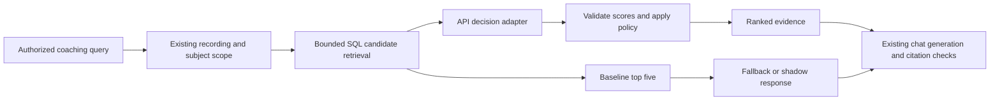

# Jev implementation plan

Status: **Proposed; research and planning only.** Researched 2026-09-18 against repository commit `b14490e`. No provider account, paid inference, private-data transfer, application changes, or deployment was performed. Architectural proposal: [decision 0026](../decisions/0026-structured-decision-provider.md). Acceptance tracking: [roadmap](roadmap.md#jev-structured-decisions--proposed-2026-09-18).

## Recommendation

Evaluate Jev first as an optional **coaching-evidence reranker**, then as a transcript-tagging capability if the first evaluation supports further investment. Keep text generation, embeddings, transcription, authorization, and durable action execution in their existing paths. Start with synthetic offline comparisons, then shadow evaluation, then an explicitly promoted opt-in rollout.

This is a quality experiment, not an assumed cost-saving migration: today's retrieval and tagging use SQL and string matching, so Jev adds inference cost and latency. It earns its place only if it improves evidence selection enough to justify those costs. Savings from fewer chat retries or smaller evidence payloads must be measured across complete answers.

## What Jev provides, and what the evidence establishes

TypeSafe's September 15 [announcement](https://typesafe.ai/blog/introducing-system-one-models-and-jev) describes System One models as structured decision models trained with Reinforcement Learning for Calibrated Decisions, using parallel outputs instead of generated prose. It advertises 70–500 ms requests and large relative speed/cost improvements. These are vendor results, not measurements in our deployment. Its “can't hallucinate” claim concerns constrained output types; a valid category can still be factually wrong.

The [workflow evaluation](https://evals.typesafe.ai/) compares four vendor-built workflows against reference probabilities from large-model consensus. This demonstrates agreement with that reference under those harnesses, not independently labeled correctness on coaching retrieval. Our human-reviewed evidence labels and end-to-end tests must decide adoption.

The [primitive overview](https://docs.typesafe.ai/introduction) describes independent questions against shared state. Questions in one request cannot consume one another's answers; dependent steps require another request or application logic.

| Primitive | Documented output | Proposed use |
| --- | --- | --- |
| [Choice](https://docs.typesafe.ai/primitives/choice) | A supplied option, its distribution, and confidence; up to 255 options | Select among known utterance handles plus an explicit `none` option |
| [Score](https://docs.typesafe.ai/primitives/score) | Expected position on an ordered rubric, distribution, and confidence; 2–10 levels | Rank evidence as unrelated, contextual, or directly supporting |
| [Noul](https://docs.typesafe.ai/primitives/noul) | Probability of yes, between 0 and 1; no separate confidence | Independent exercise/intent labels or an explicit support judgment |

[Confidence](https://docs.typesafe.ai/confidence) summarizes the shape of a distribution; it is not interchangeable with the selected option's probability or a measured accuracy percentage. For example, a Noul of 0.5 means uncertainty about a proposition, not medium relevance. Thresholds need task-specific calibration and a fallback path.

As of the research date, the [models reference](https://docs.typesafe.ai/models) lists `jev-1.13.0`, with `jev-latest` pointing to it. Inputs are text, including structured text objects; audio and images need prior conversion. Limits are 64k tokens per request and 32k for state plus the longest question. Published capacity is 1,200 requests/minute and 250,000 tokens/second, explicitly subject to change. Input pricing is $0.042/million tokens, with free output tokens. Pin a version for evaluation and promotion; record the returned model ID. Recheck account-specific access and limits before implementation.

The [quick start](https://docs.typesafe.ai/introduction/quickstart) uses bearer-authenticated `POST https://api.typesafe.ai/v1/systemone` with `state`, `model`, and `questions`. The [SDK index](https://docs.typesafe.ai/sdk) lists Python and JavaScript/TypeScript; it does not document a .NET SDK. A small typed `HttpClient` adapter fits this repository better than adding another runtime. The [API reference](https://docs.typesafe.ai/api) specifies answer maps and token usage, with 401/422 for authentication/validation and 429/529 for rate limiting/overload. Validate the actual wire contract with a synthetic request before coding against examples.

## Best uses in the current system

The priorities below are repository-specific engineering judgments, not vendor performance claims.

| Priority | Current evidence | Proposed change and value | Scope and limitation |
| --- | --- | --- | --- |
| 1: evidence reranking | [`CoachCheckinService.SearchCoachCheckinsCoreAsync`](../../PersonalAgent/Services/CoachCheckinService.cs) ranks by exercise hints, vector distance and recency, returns five chunks, and attaches preceding utterances. [Current evaluation](../runbooks/coach-retrieval-evaluation.md) records remaining exercise-transition and exact-citation errors. | Score whether each candidate actually supports the question; distinguish an actionable coach cue from an acknowledgement or adjacent topic. | API-only initial capability. Jev cannot retrieve evidence absent from the candidate pool or guarantee the final chat answer. |
| 2: semantic transcript tags | [`CoachTranscriptProcessingService`](../../PersonalAgent.Worker/Services/CoachTranscriptProcessingService.cs) groups four utterances and derives exercise/intent/priority tags with substring matching. | Independent Noul judgments over the existing vocabulary could recover paraphrases and reduce accidental matches. | Additional API capability and neutral Worker request/result contract. Preserve lexical recovery; tags remain relevance hints. Measure against today's effectively free classifier. |
| 3: offline answer review | [`CoachRetrievalEvaluation`](../../scripts/CoachRetrievalEvaluation/README.md) has repeatable trials, saved outputs, citation checks and versioned scoring. | Use Jev to flag possible unsupported claims or wrong exercise attribution for human inspection. | Supplement exact citation checks and independent labels. Do not use Jev as both sole judge and candidate, or let it promote itself. |
| Later: retrieval hints | [`AgentChatService`](../../PersonalAgent/Services/AgentChatService.cs) and its registered tools already orchestrate retrieval. | Classify a request as latest, historical, or ambiguous, or suggest a known exercise hint. | Only after reranking proves value. Extra routing risks contradicting filename corrections and conversational context; retain explicit user scope and existing tools. |

Poor initial uses:

- **Speaker identity:** [decision 0025](../decisions/0025-stereo-coach-attribution.md) deliberately uses fixed stereo channels and manual review for unknowns. Do not replace that evidence with a probabilistic guess.
- **Journal parsing replacement:** [`WorkJournalParsingService`](../../PersonalAgent/Services/WorkJournalParsingService.cs) emits dates and full original Markdown for a variable number of entries. Jev cannot directly generate those strings. A future deterministic heading parser could copy source spans and reserve classification for ambiguous cases; it should be evaluated separately.
- **Chat, summaries, embeddings, or speech recognition:** their required outputs differ from Jev's decision primitives. Existing coach summaries are templated, so there is no summary-model bill to eliminate today.
- **Authorization, scheduler execution, or safety authority:** retain server-bound actor/subject checks, tool permission checks, idempotency, and human review. Model probabilities never grant access, send notifications, or diagnose injuries.

## First slice: coaching-evidence reranking

1. Extract candidate materialization from formatting in `CoachCheckinService`, retaining exact filename precedence, latest-recording rules, unknown-date behavior, subject filtering, lexical recovery and recent-mode penalties. Materialize and dispose the SQL reader before calling the vendor. An empty scope returns the existing evidence limitation without a Jev call.
2. Keep the original five results as an immutable baseline. Experiment with a pool of up to 20 candidates from the same scoped SQL ordering; record candidate recall separately from ranking quality. Preserve enough preceding utterances to resolve topic switches. Deduplicate overlapping windows by stable internal identity. Oversized inputs fall back rather than silently losing critical context.
3. Send the question and bounded candidate text using opaque request-local handles. Omit profile IDs, actual filenames, audio, unrelated conversation history and evidence URLs. Include only required role/timing/context information. Define a relevance Score per candidate with a shared rubric: unrelated, context without the requested cue, or direct support for the requested cue. Each question's instructions must explicitly identify its candidate handle: question-map keys alone are not model-visible according to the Choice documentation.
4. Combine scores in application code. In the initial active experiment, reorder the baseline five only, keeping all five and using baseline order for ties; this isolates ranking changes from recall changes. Broader-pool replacement is a separately evaluated mode. Retain existing recency preference as a bounded tie-breaker, and never let a model override hard filename/latest scope. Do not infer “no advice exists” from low scores.
5. Low confidence, missing answers, malformed distributions, unknown handles, timeout or provider failure returns the entire original ordering. Choose thresholds on a development split, freeze them before the held-out run, and record fallback coverage. Cancellation from the caller propagates; it is not converted into a successful fallback response.
6. Preserve exact source content and server-generated citation destinations. A later, separately gated Choice may suggest one coach utterance from the supplied handles plus `none`; validate membership and retain surrounding context. No model-generated timestamp, URL or source text becomes evidence.

In shadow mode, return baseline results while capturing comparison metadata. Bound shadow concurrency and execution time; do not create unbounded fire-and-forget tasks. Use the offline runner first; if production shadow work must outlive requests, add an explicit bounded, authorized queue design before enabling it.

## Incorporation work

### Capability and adapter

Propose an API-local `ICoachEvidenceReranker` with neutral candidate/result records and statuses such as Applied, Abstained and Unavailable. Keep domain rubrics separate from a private `TypeSafeDecisionClient` responsible for HTTP serialization, credentials and vendor error mapping. A deterministic fake and baseline implementation exercise the same interface. Do not implement Jev as `IChatClient`, add it to `/api/models`, or expose arbitrary vendor questions as an agent tool.

Use .NET's existing HTTP/JSON facilities; no new service or mandatory package is needed for the spike. Validate question coverage, types, finite numbers, range bounds, option membership and probability sums within a documented tolerance. Missing usage stays unknown. Character/byte caps and conservative token estimates must respect both context limits until a verified tokenizer is available.

For the synchronous reranker, propose a 750 ms total provider budget, no inline retries, bounded concurrency, and a circuit breaker. These are initial application budgets to test, not provider guarantees. Offline/background work may retry 429/529 and transient transport failures with jitter, `Retry-After`, a total deadline and a small attempt limit. Never retry 401/422 automatically. Avoid logging vendor error bodies. Repeated classification can incur another charge even though it has no domain side effect.

### Configuration, privacy and telemetry

Follow [0004](../decisions/0004-agent-service-boundary.md), [0010](../decisions/0010-runtime-integration-settings.md), [0012](../decisions/0012-live-provider-credentials.md) and [0020](../decisions/0020-live-database-telemetry-settings.md). Store the secret in encrypted API-owned database configuration; use the administrator settings flow for masked keep/replace/clear. Add typed validation and immutable revisions for mode (`Off`, `Shadow`, `Active`), model version, policy version, budgets and thresholds. Default Off. Validate/promote a complete snapshot, retain the last valid revision, and reload for new calls; no new environment variables. Keep vendor-specific configuration out of Worker and the shared host-infrastructure library's domain logic.

Before any private transcript is sent, confirm account retention, deletion, processing location and access terms. The [models page](https://docs.typesafe.ai/models) says requests are not used for training and refers to enterprise zero retention; that does not establish zero retention for our account. Synthetic-only evaluation can proceed independently of that review. Never copy private examples or credentials into Git or public PR evidence.

Extend existing `AiTelemetry` with metadata-only capability/model/policy revision, latency, candidate counts, usage when supplied, abstention/fallback reason and provider error category. Do not export prompts, transcript text, filenames, raw answers, keys or subject IDs. Keep detailed evaluation evidence only in ignored local artifacts. A future cache must key on subject scope, query/content hash, model and policy version and recheck access before use; omit caching from the first slice.

### Tagging follow-up, only after a separate go decision

Add neutral Contracts messages for chunk classification and an API consumer; Worker retains chunking and outbox-backed domain persistence. Batch independent labels over a fixed taxonomy, with Unknown/abstain behavior. Persist proposed annotations separately with content hash and classifier version so existing tags and embeddings remain recoverable. Do not hold database transactions during vendor requests. Deduplicate redelivery by subject, source version and classifier version; apply results only if the source still matches. Provider failure preserves current substring tags and does not fail an otherwise valid transcript. Historical backfill is a bounded, resumable opt-in job, not an implicit side effect of deployment.

## Evaluation and promotion gates

Extend the existing runner with a decision-provider experiment mode; keep the chat model, embedding model and corpus fixed across paired runs. Compare (a) current five-result baseline, (b) same five reranked by Jev, and (c) wider-pool reranking. This separates ranking gains from candidate expansion. If worthwhile, add an existing chat model answering the same fixed rubric as a cost/quality comparator. Do not compare unlike tasks to reproduce headline speedups.

Freeze a synthetic development set and at least 100 held-out questions spanning multiple independent recording scenarios. Split by recording/scenario, not paraphrase, to reduce leakage. Include wrong-topic neighbors, multi-exercise transitions, negation, uncertain attribution, second-utterance cues, latest/exact/historical scope, missing recordings, empty subjects, unknown dates, adversarial transcript instructions and cross-subject markers. Labels identify supporting utterances and acceptable uncertainty; a human reviews disputed cases. Repeats measure variability and do not increase the independent sample count.

Report candidate recall@20, supporting-evidence recall@5, nDCG@5, exact-utterance citation correctness, complete-answer pass rate, unsupported-attribution rate, fallback/abstention coverage, Brier score and reliability bins for probability judgments. Include sample counts and uncertainty intervals; confidence concentration alone is not calibration evidence. Record all failures and timeouts in denominators, model/policy/dataset/source versions, p50/p95 end-to-end latency, and available usage/cost.

Proposed gates, to freeze before live evaluation:

- All existing retrieval/citation regressions and authorization tests pass; zero cross-subject disclosures or scope violations, including inspection of outbound fake-provider requests.
- At least a five-percentage-point held-out complete-answer improvement, no increase in unsupported exercise attribution, and no decrease in evidence recall@5. Review paired uncertainty intervals; inconclusive results mean more evidence or retaining Off.
- Added p95 answer latency at most 750 ms; provider timeout reliably restores the baseline. Record fallback rate, since a fast system that almost always bypasses Jev does not establish useful integration.
- Incremental decision cost below $0.001 per search under the measured workload. At the published rate, a hypothetical 5,000 billed-input-token request costs $0.00021; 10,000 such searches cost $2.10 before retries. These are arithmetic scenarios, not measured usage; include question tokens and repeated state across separate calls. Do not count unknown usage as zero.
- Off immediately restores current behavior for new calls; invalid configuration retains the working revision; promotion and rollback are auditable. No application availability dependency on Jev when disabled or unavailable.

Use fake HTTP tests for valid primitives, incomplete/invalid payloads, unknown options, 401/422/429/529, cancellation, timeout and key rotation. Add PostgreSQL tests for unchanged subject/recording scope and citation membership. Synthetic Compose must work without TypeSafe access. CI remains deterministic; real-provider evaluations are explicit local runs with recorded budgets.

## Delivery sequence and effort

Estimates are planning ranges for one developer familiar with this codebase, excluding vendor access wait, data review and production observation.

| Slice | Deliverable | Estimate | Exit condition |
| --- | --- | --- | --- |
| 0 | Obtain access; synthetic contract/usage/latency probe; confirm pinning and terms | 0.5–1 day | Verified response fixtures and known account limits; private data still gated |
| 1 | API capability, HTTP adapter, fake, database settings and telemetry | 2–3 days | Contract/failure/reload tests pass; default Off; no Worker or chat-catalog change |
| 2 | Retrieval seam, bounded shadow mode, paired evaluation and independent labels | 2–4 days | Reproducible report against frozen baseline; full current regressions pass |
| 3 | Review gates, limited Active rollout, rollback verification and runbook | 1–2 days | Measured quality/latency/cost and tested Off switch; otherwise retain Off |
| Optional | Semantic tags with neutral bus contract, provenance and resumable backfill | 3–5 days | Separate accuracy/cost evaluation and redelivery/source-change tests |

The initial rollout is roughly 5.5–10 developer days, with scope reduced if the contract probe or held-out comparison fails. Merging this plan authorizes neither private-data transfer nor production activation. Open questions before activation: account access and retention terms, regional latency, actual question/token limits, stable pinned-model availability, and whether quality improves enough to justify another provider. An inconclusive or negative result is a valid outcome; retain the baseline and publish the bounded evaluation finding.
